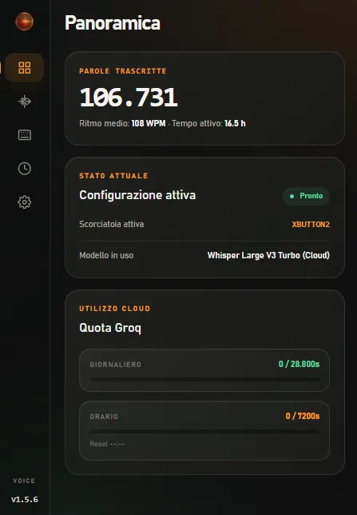

<div align="center">

# Traflix Voice

Privacy-focused desktop voice dictation for Windows.

Speak, transcribe, and paste text into the currently focused application.

<p>
  
</p>

</div>

Traflix Voice is a Windows desktop application built with Tauri 2, Rust, React,
TypeScript, and Python. It provides a local-first workflow with optional cloud
transcription when the user explicitly enables Groq.

## Features

- Local Whisper transcription through `whisper.cpp` and `pywhispercpp`.
- Optional Groq transcription using `whisper-large-v3-turbo`.
- Configurable global hotkeys, click-to-toggle, and hold-to-speak recording.
- Automatic paste into the focused application.
- Downloadable Base and Small local models from Hugging Face.
- CPU and optional CUDA device selection.
- Live waveform, always-on-top status overlay, and system-tray access.
- Local history and usage statistics.
- Multiple languages with automatic language detection.

## Supported workflow

1. Start the application and select a microphone in **System**.
2. Choose a local model in **AI**, or explicitly enable Groq cloud mode.
3. Press the configured hotkey and speak.
4. Press it again to stop. The transcription is shown in the app and can be
   pasted into the focused application.

Windows 10 and Windows 11 are the supported platforms. macOS and Linux are not
currently validated. Local transcription requires a downloaded model; cloud
mode does not require a local Whisper model.

## Installation

Prerequisites: Node.js 24, Python 3.12, a stable Rust toolchain, and the
Microsoft Edge WebView2 Runtime.

```powershell
git clone https://github.com/iTzFrancesco/Traflix-Voice.git
cd Traflix-Voice
npm ci
python -m pip install -r src-tauri/requirements.txt
npm run tauri dev
```

On first use, open **AI** and download a local model. The Small model is a
reasonable starting point for general dictation.

## Development and testing

```powershell
npm run build
python -m pytest src-tauri/test_*.py -v
cd src-tauri
cargo fmt --check
cargo clippy -- -D warnings
cargo test
```

Focused benchmark scripts and technical reports are under `scripts/` and
`docs/`. Their measurements are environment-specific and are not guarantees.

## Privacy and data handling

Local mode processes audio on the device after the selected Whisper model has
been downloaded. Cloud mode sends recorded audio to Groq only after the user
configures that provider in the application. The optional API key is stored in
the application's local settings and is not required in the repository.

History, settings, statistics, usage data, and downloaded models are stored in
the operating system's application-data directory. Never commit API keys,
tokens, passwords, or a populated `.env` file; use [`.env.example`](.env.example)
only as documentation. See [`SECURITY.md`](SECURITY.md) for reporting guidance.

## Architecture

- **Rust/Tauri** owns the desktop shell, hotkeys, clipboard, tray, settings,
  and Python process supervision.
- **React/TypeScript/Vite** provides the main interface and overlay.
- **Python** captures audio, manages Whisper models, performs local inference,
  and optionally calls Groq.

## Third-party components

Traflix Voice uses Whisper/whisper.cpp, `pywhispercpp`, Hugging Face model
hosting, and the optional Groq API. These components remain subject to their
own licenses and terms. Traflix Voice is independent and is not affiliated
with OpenAI, Groq, or Hugging Face.

## License

Traflix Voice is available under the [MIT License](LICENSE).
